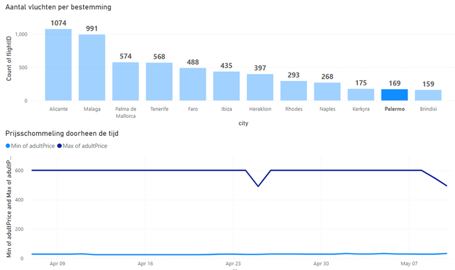

<!DOCTYPE html>
<html>
<head>
</head>
<body style="height: 100%">
  <div style="height: 100vh; display: flex; flex-direction: column; justify-content: space-between; align-items: center; color: black; text-align: center;">
    <div>
        
        <p style="font-size: 24px;">Faculteit IT en digitale innovatie</p>
    </div>
    <div>
      <h1 style="font-size: 48px; margin-bottom: 20px;">Analysereport<br>Data-<br>Engineering<br>Project</h1>
    </div>
    <div>
      <p style="font-size: 18px;">Groepsnummer 10<br>Begeleidende lector: Patrick Van Renterghem<br>Groepsleden: Floris Buyse, Emma De Koster<br>Max Milan, Marlon Engels<br>Datum: 11/05/2023</p>
    </div>
  </div>
</body>
</html>


# Vraag 1: welke vliegtuigmaatschappij is gemiddeld de goedkoopste/duurste?


### Versie gemaakt met pandas


Deze code was vrij eenvoudig. We hebben een Dataframe gemaakt van de factFlights-tabel en vervolgens gegevens geselecteerd op basis van de carrierID. In dit geval hebben we carrierID 1 voor Ryanair, 2 voor TUIfly en 3 voor Transavia gebruikt. Vervolgens hebben we de adultPrice opgehaald en met behulp van de ingebouwde pandas-functie mean() het gemiddelde van de prijzen berekend. Hieronder vind je de code die we hebben gebruikt om het gemiddelde van de prijzen voor Ryanair te verkrijgen (code voor andere maatschappijen is volledig hetzelfde behalve de carrierID). Daarna hebben we de drie gemiddelde prijzen in een horizontale staafdiagram geplaatst.

## Code:

```Python
ryanair_mean_price = df_fact_flights[df_fact_flights['carrierID'] == 3]['adultPrice'].mean()

plt.figure(figsize=(10, 5))

carrier_codes = ['FR', 'TB', 'HV']
carrier_names = ['Ryanair', 'TUI', 'Transavia']

carrier_mean_prices = [ryanair_mean_price, tui_mean_price, transavia_mean_price]

colors = ['#1f77b4', '#ff7f0e', '#2ca02c']

plt.barh(carrier_names, carrier_mean_prices, color=colors)
plt.title('(1) Welke vliegtuigmaatschappij is gemiddeld de goedkoopste / de duurste?')
plt.xlabel('Gemiddlede prijs')
```

---

# Vraag 2: Hoe vaak vliegt elke vliegtuigmaatschappij naar elk van de bestemmingen?


---

# Vraag 3: Welke vliegtuigmaatschappij biedt de snelste vlucht aan naar een bepaalde bestemming?  


---


# Vraag 4: Welke vliegtuigmaatschappij biedt de goedkoopste vlucht aan naar een bepaalde bestemming?


---


# Vraag 5: Welke vliegtuigmaatschappij biedt een vlucht aan zonder tussenstops, met maximum 1?


---


# Vraag 6: Rapport over prijsevolutie en beschikbaarheidsevolutie doorheen de tijd (Beperkt tot Alicante en 21 april 2023)


Voor deze vraag op te lossen in Power BI hebben we twee extra kolommen toegevoegd aan factflights. De datum voor scrape date en departure date werden reeds opgeslagen maar slechts als unix time. We hebben deze omgezet naar de normale tijd DD/MM/YYYY.

Volgende stukken werden gebruikt om de kolommen te creëren:
`departureDate = DATE(1970, 1, 1) + ('airfaresdwh factflights'[departureDateID] / 86400) + TIME(0, 0, 0) + TIME(2, 0, 0)`

`scrapeDate = DATE(1970, 1, 1) + ('airfaresdwh factflights'[scrapeDateID] / 86400) + TIME(0, 0, 0) + TIME(2, 0, 0)`

---


# Vraag 7: Is er een correlatie met de vakantiebestemmingen: zijn bepaalde bestemmingen significant duurder dan andere bestemmingen?


---


# Vraag 8: Zijn de prijzen gerelateerd aan vakantieperiodes (hier in België)?


Eerst wordt de dimDate-tabel geconverteerd naar een dataframe (niet zichtbaar in de onderstaande code). Vervolgens wordt de kolom 'fullDate' omgezet naar het Pandas datetime-formaat. Alle gegevens na de 184e index worden verwijderd, omdat ze buiten de scope van de opdracht vallen (data na 1 oktober). Het dataframe van factFlights wordt samengevoegd met het dataframe van dimDate op basis van de kolommen 'departureDateID' en 'dateID'.

Voor het plotten van de grafiek worden de resulterende gegevens gebruikt. Om de vakantieperiodes zichtbaar te maken, wordt een for-loop gebruikt om door alle data te itereren. Telkens wanneer de kolom 'isItVacationDay' gelijk is aan 1, wordt een extra verticale rode stippenlijn toegevoegd aan de grafiek.

## Code:

```Python
df_date['fullDate'] = pd.to_datetime(df_date['fullDate'])
df_date = df_date.drop(df_date.index[184:])
df_date = df_date.reset_index(drop=True)

df_flight_on_vacation_day = pd.merge(df_fact_flights, df_date, left_on='departureDateID', right_on='dateID')

plt.bar(df_flight_on_vacation_day['fullDate'], df_flight_on_vacation_day['adultPrice'], color='blue', label='Prijs per dag')

for _, row in df_date.iterrows():
    if row['isItVacationDay'] == 1:
        plt.axvline(x=row['fullDate'], color='red', linestyle='--', alpha=0.5)

plt.title('(8) Zijn de prijzen gerelateerd aan de vakantieperiodes?')
plt.xlabel('Datum')
plt.ylabel('Prijs')
plt.xticks(rotation=45)
plt.legend(loc='upper right')
plt.tight_layout()

red_line = plt.Line2D([], [], color='red', linestyle='--', alpha=0.5, label='Vakantieperiodes')
blue_line = plt.Line2D([], [], color='blue', label='Prijs per dag')
plt.legend(handles=[red_line, blue_line], loc='upper right')

plt.show()
```

---


# Vraag 9: Kan je de prijsstrategie afleiden? (Invloed van aantal dagen voor vertrek, invloed van beschikbaarheid)


Voor deze vraag in Power BI, hebben we ook vorige twee kolommen 'ScrapeDate' en 'DepartureDate' ([aangemaakt in vraag 6](#vraag-6-rapport-over-prijsevolutie-en-beschikbaarheidsevolutie-doorheen-de-tijd-beperkt-tot-alicante-en-21-april-2023)) als normale vorm nodig. Ook hebben we een andere extra kolom toegevoegd nl. DaysBeforeDeparture.

Het volgende stuk werd gebruikt om de kolom te maken: 
`daysBeforeDeparture = DATEDIFF('airfaresdwh factflights'[scrapeDate].[Date], 'airfaresdwh factflights'[departureDate].[Date], DAY)`

### Voorbeeld analyse in pandas Ryanair naar alicante: 


Hier beginnen we ook met het droppen van Datum data na index 184 en het mergen van factFlights en dimDate (zoals bij vraag 8). Vervolgens zetten we de kolommen 'scrapeDateID' en 'departureDateID' om naar "human-readable" datums (stonden origineel in UNIX tijd).

Daarna maken we een nieuwe kolom aan: 'daysBeforeDeparture'. Dit verwezenlijken we door de 'fullDate' af te trekken van de 'scrapeDateID'.

Hierna mergen we het Dataframe bestaande uit dimDate en factFlights met het Dataframe van dimAirport op basis van de kolommen 'arrAirportID' en 'airportID'. We droppen hierna alle kolommen die niet van toepassing zullen zijn voor deze vraag.

Als laatste splitsen we dit Dataframe (genaamd df_total) op in df_ryanair, df_tui en df_transavia. 

df_total.head(5) geeft het volgende weer:


De resterende code wordt gebruikt om een subplot-grid van grafieken aan te maken. Het aantal rijen in het grid wordt bepaald door het aantal unieke waarden in de kolom 'airportCode' van het DataFrame df_ryanair. Het grid heeft 2 kolommen.

Vervolgens wordt er een lus uitgevoerd waarin de code voor elke unieke luchthavencode wordt herhaald. Binnen de lus wordt een subset van het DataFrame gemaakt voor de specifieke luchthavencode en alleen de gegevens die zich binnen 30 dagen voor vertrek bevinden.

De subset wordt gebruikt om de gemiddelde prijs ('meanPrice') en het gemiddelde aantal beschikbare stoelen ('meanSeats') te berekenen. Duplicaten worden verwijderd op basis van de kolom 'daysBeforeDeparture'.

De grafieken worden getekend op respectieve assen (ax1 en ax2) in het subplot-grid. Het aantal assen is afhankelijk van het aantal unieke luchthavencodes. Als er slechts één unieke luchthavencode is, worden de grafieken getekend op axs[0] en axs[1].

## Code:

```Python
df_date = df_date.drop(df_date.index[184:])
df_date = df_date.reset_index(drop=True)

df_total = pd.merge(df_fact_flights, df_date, left_on='departureDateID', right_on='dateID')

# unix timestamp to datetime
df_total['scrapeDateID'] = pd.to_datetime(df_total['scrapeDateID'], unit='s')
df_total['scrapeDateID'] = df_total['scrapeDateID'] + timedelta(hours=2)

df_total['departureDateID'] = pd.to_datetime(df_total['departureDateID'], unit='s')
df_total['departureDateID'] = df_total['departureDateID'] + timedelta(hours=2)

# nieuwe kolom met verschil in dagen tussen scrapeDateID en departureDateID
df_total['fullDate'] = pd.to_datetime(df_total['fullDate'])

df_total['daysBeforeDeparture'] = df_total['fullDate'] - df_total['scrapeDateID']
df_total['daysBeforeDeparture'] = df_total['daysBeforeDeparture'].dt.days

# arrAirportName toevoegen
df_total = pd.merge(df_total, df_airport, left_on='arrAirportID', right_on='airportID')

# nutteloze kolommen verwijderen
df_total = df_total.drop(['dayName', 'arrivalDateID', 'dayOfYear', 'isItWeekend', 'dateID', 'factID', 'depAirportID', 'arrAirportID', 'flightID', 'quarter', 'airportID', 'airportName', 'previous_day', 'next_day', 'week_of_year'], axis=1)

# opsplitsen in 3 dataframes voor de 3 carriers
df_ryanair = df_total[df_total['carrierID'] == 3]
df_transavia = df_total[df_total['carrierID'] == 1]
df_tui = df_total[df_total['carrierID'] == 2]

# plotten
fig, axs = plt.subplots(len(df_ryanair['airportCode'].unique()), 2, figsize=(15, 5 * len(df_ryanair['airportCode'].unique())))

for i, airport in enumerate(df_ryanair['airportCode'].unique()):
    df_airport = df_ryanair[df_ryanair['airportCode'] == airport]
    df_airport = df_airport[df_airport['daysBeforeDeparture'] <= 30]
    
    df_airport['meanPrice'] = df_airport.groupby('daysBeforeDeparture')['adultPrice'].transform('mean')
    df_airport = df_airport.drop_duplicates(subset=['daysBeforeDeparture'])

    df_airport['meanSeats'] = df_airport.groupby('daysBeforeDeparture')['availableSeats'].transform('mean')
    df_airport = df_airport.drop_duplicates(subset=['daysBeforeDeparture'])

    ax1 = axs[i, 0] if len(df_ryanair['airportCode'].unique()) > 1 else axs[0]
    ax2 = axs[i, 1] if len(df_ryanair['airportCode'].unique()) > 1 else axs[1]
    
    ax1.bar(df_airport['daysBeforeDeparture'], df_airport['meanPrice'], color='#1f77b4', label='Prijs per dag')
    ax1.set_title(f'Prijsstrategie - aantal dagen voor vertrek: Ryanair - {airport}')
    ax1.set_xlabel('Aantal dagen voor vertrek')
    ax1.set_ylabel('Prijs')
    ax1.legend(loc='upper right')
    
    ax2.bar(df_airport['availableSeats'], df_airport['meanPrice'], color='#ff7f0e', label='Beschikbare stoelen per dag')
    ax2.set_title(f'Beschikbare stoelen - aantal dagen voor vertrek: Ryanair - {airport}')
    ax2.set_xlabel('Aantal beschikbare stoelen')
    ax2.set_ylabel('Prijs')
    ax2.legend(loc='upper right')


plt.tight_layout()
plt.show()
```

---


# Vraag 10: Is er een link tussen prijs en afstand (en duration)? Bijvoorbeeld Tenerife is anderhalf uur verder dan Alicante.


---


# Vraag 11: Is er een link tussen prijs en land? Zijn sommige landen opvallend duurder (en kan dit niet verklaard worden door de extra afstand)?


---


# Vraag 12: Hoeveel dagen voor vertrek is een vlucht volgeboekt? Zijn er bestemmingen waarbij de vluchten bijna volgeboekt zijn?


Om deze vraag te beantwoorden, hebben we eerst alle rijen uit de tabel ‘factFlights’ geselecteerd waarbij er geen beschikbare plaatsen meer waren. Vervolgens hebben we deze rijen gegroepeerd op vluchtnummer en hebben we alleen de eerste datum genomen die voorkomt.
Daarna hebben we berekend hoeveel dagen er nog over zijn tot aan de vertrekdatum. Bij deze stap hebben we voor elke bestemming het gemiddeld aantal dagen tot de vertrekdatum berekend en vervolgens een staafdiagram van gemaakt.

## Code:

```Python
fully_booked_df = df_fact_flights[df_fact_flights['availableSeats'] == -1] 

fully_booked_df['days_before_departure'] = (pd.to_datetime(fully_booked_df['departureDateID'], unit='s') - pd.to_datetime(fully_booked_df['scrapeDateID'], unit='s')).dt.days

average_days_before_departure = fully_booked_df.groupby('arrAirportID')['days_before_departure'].mean()

city_names = df_airport[df_airport['airportID'].isin(average_days_before_departure.index)]['city']

plt.bar(city_names, average_days_before_departure)
plt.xlabel('City')
plt.ylabel('Average Days Before Departure')
plt.title('Average Days Before Departure That a Flight is Fully Booked per City')
plt.xticks(rotation=45)
plt.show()
```

---

# Vraag 13: Hoeveel procent van de vluchten zijn volgeboekt? / Hoeveel plaatsen zijn er nog vrij 5 dagen voor vertrek?


Het doel van deze grafiek is om de bestemming te identificeren waar je de meeste kans hebt om last-minute een ticket te bemachtigen.
Om dit te bereiken, hebben we eerst alle rijen uit de tabel ‘factFlights’ geselecteerd waarbij de scrape datum vijf dagen voor de vertrekdatum lag. Vervolgens hebben we deze rijen gegroepeerd op bestemming en het gemiddelde aantal beschikbare plaatsen berekend.
Met behulp van deze gegevens hebben we een staafdiagram gemaakt om de resultaten visueel weer te geven.

## Code:

```Python
depDate = pd.to_datetime(df_fact_flights['departureDateID'], unit='s')
scrapeDate = pd.to_datetime(df_fact_flights['scrapeDateID'], unit='s') 

filtered_df = df_fact_flights[depDate - scrapeDate == timedelta(days=5)] 
grouped_df = filtered_df.groupby('arrAirportID') 

average_available_seats_per_destination = grouped_df['availableSeats'].mean()

city_names = df_airport[df_airport['airportID'].isin(average_available_seats_per_destination.index)]['city']

plt.bar(city_names, average_available_seats_per_destination)
plt.xlabel('City')
plt.ylabel('Average Available Seats')
plt.title('Average Available Seats 5 Days Before Departure per Destination')
plt.xticks(rotation=45)
plt.show()
```

---

# Vraag 14a: Plot het verband tussen de prijs en het aantal dagen voor vertrek voor Ryanair voor de afgelopen maand.


Het doel van deze grafiek is om het optimale moment voor het boeken van een Ryanair-vlucht te bepalen 30 dagen voor vertrek. 

Om dit te bereiken, beginnen we met het selecteren van alle rijen uit de tabel 'factFlights' waarbij de maatschappij Ryanair is en de scrape datum binnen 30 dagen voor de vertrekdatum van de vlucht valt. 

Vervolgens groeperen we deze rijen op basis van het aantal dagen voor vertrek, waardoor we 30 groepen krijgen, en berekenen we het gemiddelde van de prijzen. 

Met behulp van deze gegevens stellen we een grafiek op om de informatie visueel weer te geven. 

## Code:

```Python
one_month_ago = datetime.now() - timedelta(days=30)

ryanair_flights = df_fact_flights[(df_fact_flights['carrierID'] == 3) & 
                                  (pd.to_datetime(df_fact_flights['departureDateID'], unit='s').dt.month == one_month_ago.month)]

ryanair_flights['days_before_departure'] = (pd.to_datetime(ryanair_flights['departureDateID'], unit='s') - pd.to_datetime(ryanair_flights['scrapeDateID'], unit='s')).dt.days

ryanair_flights_30_days = ryanair_flights[ryanair_flights['days_before_departure'] <= 30]

average_prices = ryanair_flights_30_days.groupby('days_before_departure')['adultPrice'].mean().sort_index(ascending=False)

plt.plot(average_prices.index, average_prices.values)
plt.xlabel('Dagen voor vertrek')
plt.ylabel('Gemiddelde prijs')
plt.title('Verband tussen prijs en dagen voor vertrek voor Ryanair (voor de afgelopen maand)')
plt.xlim(max(average_prices.index), min(average_prices.index))
plt.grid()
plt.show()
```

---


# Vraag 14b:  Maak gebruik van regressie om de prijzen te voorspellen voor de volgende maand.


Het doel van deze grafiek is om een voorspelling te maken van de prijs per aantal dagen voor vertrek voor de volgende maand. 

(Het begin is hetzelfde als bij vraag 9)
Hier beginnen we ook met het droppen van Datum data na index 184 en het mergen van factFlights en dimDate. Vervolgens zetten we de kolommen 'scrapeDateID' en 'departureDateID' om naar "human-readable" datums (stonden origineel in UNIX tijd).

Daarna maken we een nieuwe kolom aan: 'daysBeforeDeparture'. Dit verwezenlijken we door de 'fullDate' af te trekken van de 'scrapeDateID'.

Hierna mergen we het Dataframe bestaande uit dimDate en factFlights met het Dataframe van dimAirport op basis van de kolommen 'arrAirportID' en 'airportID'. We droppen hierna alle kolommen die niet van toepassing zullen zijn voor deze vraag.

We nemen alleen de data met carrierCode == 3 (Ryanair) en nemen hiervan alleen de data van de afgelopen maand. We splitsen nog verder op zodat we alleen de data hebben waarbij daysBeforeDeparture kleiner of gelijk is aan 30 en droppen nog enkele niet-gebruikte kolommen.

**Dit is de .info() van het resulterende Dataframe:**

```
Data columns (total 8 columns):
 #   Column               Non-Null Count  Dtype  
---  ------               --------------  -----  
 0   availableSeats       2353 non-null   int64  
 1   adultPrice           2353 non-null   float64
 2   dayOfMonth           2353 non-null   int64  
 3   monthNumber          2353 non-null   int64  
 4   year                 2353 non-null   int64  
 5   isItVacationDay      2353 non-null   int64  
 6   daysBeforeDeparture  2353 non-null   int32  
 7   city                 2353 non-null   object 
dtypes: float64(1), int32(1), int64(5), object(1)
```

Zoals je hierboven kan zien is city van het Dtype 'object'. Dit moeten we omzetten zodat we LinearRegression kunnen gebruiken. Dit doen we met behulp van OneHotEncoding. Hieronder het resultaat van de OneHotEncoding:


Daarna splitsen we de data op in X en y, en nog eens verder in X_train, X_test, y_train en y_test en testen we het model. Hieronder vind je de resultaten van het model.

**Testresultaten van het model**

Mean Absolute Error: 44.177281730770105
Mean Squared Error: 3297.2652815265114
Root Mean Squared Error: 57.421818862924496
accuracy_score: 0.5434510123592607

Om de prijzen van volgende maand te voorspellen doen we hetzelfde als hierboven beschreven staat, maar veranderen we het Dataframe naar de data van volgende maand (df_next_month). Na het OneHotEncoden van deze data (van de city kolom), maken we een nieuw Dataframe aan waarin we enkel de 'adultPrice', 'daysBeforeDeparture', 'predictedPrice' en 'difference' hebben zitten (genaamd df_next_month_prices). Hiermee zullen we ook de grafiek maken na het berekenen van de gemiddelde prijs, gegroepeerd per 'daysBeforeDeparture'.

**df_next_month_prices:**


## Code:

```Python
df_date = df_date.drop(df_date.index[184:])
df_date = df_date.reset_index(drop=True)

df_total = pd.merge(df_fact_flights, df_date, left_on='departureDateID', right_on='dateID')

# unix timestamp to datetime
df_total['scrapeDateID'] = pd.to_datetime(df_total['scrapeDateID'], unit='s')
df_total['scrapeDateID'] = df_total['scrapeDateID'] + timedelta(hours=2)

df_total['departureDateID'] = pd.to_datetime(df_total['departureDateID'], unit='s')
df_total['departureDateID'] = df_total['departureDateID'] + timedelta(hours=2)

# nieuwe kolom met verschil in dagen tussen scrapeDateID en departureDateID
df_total['fullDate'] = pd.to_datetime(df_total['fullDate'])

df_total['daysBeforeDeparture'] = df_total['fullDate'] - df_total['scrapeDateID']
df_total['daysBeforeDeparture'] = df_total['daysBeforeDeparture'].dt.days

# arrAirportName toevoegen
df_total = pd.merge(df_total, df_airport, left_on='arrAirportID', right_on='airportID')

# nutteloze kolommen verwijderen
df_total = df_total.drop(['dayName', 'dayOfWeek', 'monthName', 'arrivalDateID', 'dayOfYear', 'isItWeekend', 'dateID', 'factID', 'depAirportID', 'arrAirportID', 'flightID', 'quarter', 'airportID', 'airportName', 'previous_day', 'next_day', 'week_of_year'], axis=1)

one_month_ago = datetime.now() - timedelta(days=30)

df_ryanair = df_total[df_total['carrierID'] == 3]
df_ryanair = df_ryanair[df_ryanair['departureDateID'].dt.month == one_month_ago.month]

df_ryanair = df_ryanair[df_ryanair['daysBeforeDeparture'] <= 30]
df_ryanair.drop(['carrierID', 'country', 'airportCode', 'fullDate', 'scrapeDateID', 'departureDateID'], axis=1, inplace=True)

df_ryanair.info()

# One Hot Encoding op city toepassen

cities = df_ryanair['city']

encoded_cities = pd.get_dummies(cities, prefix='city')

df_ryanair = pd.concat([df_ryanair, encoded_cities], axis=1)

df_ryanair.drop(['city'], axis=1, inplace=True)
df_ryanair.head(5)

# Lineair Regressie model trainen

X = df_ryanair.drop(['adultPrice'], axis=1)
y = df_ryanair['adultPrice']

X_train, X_test, y_train, y_test = train_test_split(X, y, test_size=0.2, random_state=42)

model = LinearRegression()
model.fit(X_train, y_train)
y_pred = model.predict(X_test)

print('Mean Absolute Error:', metrics.mean_absolute_error(y_test, y_pred))
print('Mean Squared Error:', metrics.mean_squared_error(y_test, y_pred))
print('Root Mean Squared Error:', np.sqrt(metrics.mean_squared_error(y_test, y_pred)))
print('accuracy_score:', model.score(X_test, y_test))

# Predicten voor volgende maand
df_next_month = df_total[df_total['departureDateID'].dt.month == one_month_ago.month + 1]

df_next_month = df_next_month[df_next_month['daysBeforeDeparture'] <= 30]
df_next_month = df_next_month[df_next_month['carrierID'] == 3]
df_next_month.drop(['carrierID', 'country', 'airportCode', 'fullDate', 'scrapeDateID', 'departureDateID'], axis=1, inplace=True)

df_next_month.info()

# One Hot Encoding toepassen op data van volgende maand
cities = df_next_month['city']

encoded_cities = pd.get_dummies(cities, prefix='city')

df_next_month = pd.concat([df_next_month, encoded_cities], axis=1)
df_next_month_prices = df_next_month[['adultPrice', 'daysBeforeDeparture']]
df_next_month.drop(['city', 'adultPrice'], axis=1, inplace=True)
df_next_month.reset_index(drop=True, inplace=True)

df_next_month.head(5)

# Predicte prijzen in Dataframe stoppen
next_month_prices = model.predict(df_next_month)

df_next_month_prices = pd.DataFrame(df_next_month_prices)
df_next_month_prices['predictedPrice'] = next_month_prices
df_next_month_prices['difference'] = df_next_month_prices['predictedPrice'] - df_next_month_prices['adultPrice']
df_next_month_prices['difference'] = df_next_month_prices['difference'].abs()
df_next_month_prices['difference'] = df_next_month_prices['difference'].round(2)
df_next_month_prices['predictedPrice'] = df_next_month_prices['predictedPrice'].round(2)
df_next_month_prices.reset_index(drop=True, inplace=True)

# Gemiddelde prijs berekenen en plotten
average_prices = df_next_month_prices.groupby('daysBeforeDeparture')['adultPrice'].mean().sort_index(ascending=False)

plt.plot(average_prices.index, average_prices.values)
plt.xlabel('Dagen voor vertrek')
plt.ylabel('Gemiddelde prijs')
plt.title('Verband tussen prijs en dagen voor vertrek voor Ryanair')
plt.xlim(max(average_prices.index), min(average_prices.index))
plt.grid()
plt.show()

```

---


# Vraag 15: In PowerBI een kaart maken met de mogelijke bestemmingen als de prijs in een bepaalde range moet liggen + op een bepaald moment?

### Algemeen:


### Met slicers (tweede week paasvakantie tussen 19.99 en 60 euro):


Bij het gebruiken van de slicers werd er ook gebruik gemaakt van de nieuwe kolom 'DepartureDate' ([aangemaakt in vraag 6](#vraag-6-rapport-over-prijsevolutie-en-beschikbaarheidsevolutie-doorheen-de-tijd-beperkt-tot-alicante-en-21-april-2023)).
---


# Vraag 16: Welke vliegtuigmaatschappij biedt de meeste directe vluchten aan naar een specifieke bestemming?


---


# Vraag 17: Welke luchthavens hebben de hoogste gemiddelde ticketprijzen voor specifieke bestemmingen?


---


# Vraag 18: Welke bestemmingen hebben de grootste vraag naar vluchten en zijn daarom het meest gevoelig voor prijsschommelingen?

### Alicante:


### Palermo:


De onderste grafiek maakt gebruik van de nieuwe kolom 'ScrapeDate' ([aangemaakt in vraag 6](#vraag-6-rapport-over-prijsevolutie-en-beschikbaarheidsevolutie-doorheen-de-tijd-beperkt-tot-alicante-en-21-april-2023)) zo kunnen we de tijd mooi weergeven.

---


# Vraag 19: Welke dag van de week zijn de prijzen, per bestemming, gemiddeld het laagst?

### Algemeen:


### Napels:


### Tenerife:


---


# Vraag 20: Wat is het goedkoopste vertrekuur voor vluchten?


---
